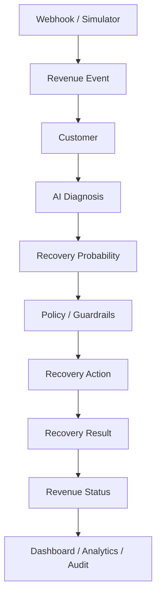
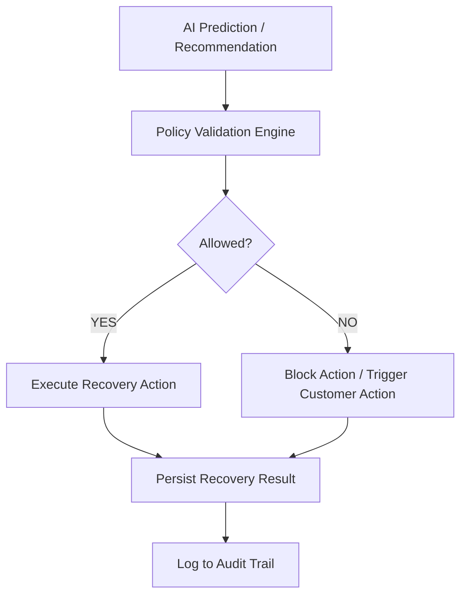

# RecoverAI — AI Revenue Recovery Platform

> **Hackathon Track 03 — AI Revenue Recovery**  
> *"AI recommends. Policy controls. Recovery executes. Measurement proves."*

RecoverAI is a policy-bounded AI revenue recovery platform engineered for subscription and payment failure workflows. It processes payment signals, diagnoses root causes using machine learning models and domain heuristics, evaluates business policy boundaries, and automates recovery interventions—from smart payment retries to B2B promise-to-pay tracking—with full financial measurement and auditability.

---

## 💡 Problem

Modern digital businesses lose significant revenue to non-technical and process-driven failure points across the customer lifecycle:

- **Failed Payments**: Soft declines (insufficient funds, temporary issuer unavailability) and hard declines (expired cards, closed accounts).
- **Checkout Abandonment**: Drop-offs during high-intent payment flows before payment completion.
- **Failed Subscriptions**: Recurring billing failures caused by expired payment methods or revoked e-NACH/UPI mandates.
- **Overdue B2B Receivables**: Uncollected invoices sitting in accounts receivable past payment terms.
- **Broken Payment Promises**: Customers who commit to a future payment date but fail to fulfill their commitment.

---

## 🛠 Solution

RecoverAI manages revenue recovery through a structured, multi-stage lifecycle:

```
Detect → Diagnose → Decide → Policy/Guardrails → Act → Measure → Audit
```

1. **Detect**: Ingest real-time failure signals from Razorpay webhooks (Test Mode) or simulator events.
2. **Diagnose**: Categorize failure causes (`soft_decline`, `hard_decline`, `mandate_revoked`, `checkout_abandonment`, `invoice_overdue`, `promise_broken`).
3. **Decide**: ML model calculates recovery probability for payment events, or deterministic domain logic determines the appropriate recovery action.
4. **Policy/Guardrails**: Strict policy engine validates actions against safety rules (retry limits, mandate status, chaser caps, promise protection).
5. **Act**: Execute approved interventions (controlled retry, payment reminder, method update request, escalation).
6. **Measure**: Track financial recovery amounts and intervention costs to quantify net revenue recovered.
7. **Audit**: Persist a complete audit record of every signal, diagnosis, policy check, and action outcome.

---

## 🏗 System Architecture



### Key Architectural Boundaries

- **AI Recommendation**: Probabilistic Machine Learning model predicts recovery likelihood based on customer payment history and failure attributes.
- **Policy Enforcement**: Hard deterministic business rules validate whether recommended actions satisfy retry caps, mandate rules, and communication bounds before execution.
- **Deterministic Domain Workflows**: Dedicated state machines manage Checkout Abandonment, B2B Receivables, and Promise-to-Pay workflows without forcing ML inference where rules are appropriate.

---

## ⚡ What Makes RecoverAI Different

| Feature / Capability | RecoverAI Implementation |
|---|---|
| **AI Recovery Prediction** | Random Forest model evaluating recovery probability from payment features |
| **Payment Recovery** | Smart retry execution bounded by failure code and attempt count |
| **Checkout Abandonment** | Automated payment reminders bounded to 1 attempt to prevent customer spam |
| **Failed Subscription** | Recurring payment retry orchestration aware of e-NACH/UPI mandate status |
| **Mandate-Aware Recovery** | Automatic block on retries if mandate is `revoked`, `inactive`, or `cancelled` |
| **B2B Receivables Chasing** | Tiered payment reminders (first, second, final) capped at 3 attempts |
| **Promise-to-Pay Tracking** | Dedicated state machine (`PROMISE_PENDING` → `PARTIALLY_FULFILLED` / `FULFILLED` / `BROKEN` → `ESCALATED`) |
| **Bounded Recovery Actions** | Policy engine guarantees AI recommendations never execute outside business limits |
| **Idempotency** | Duplicate event IDs, transaction IDs, checkout IDs, subscription attempts, B2B chase IDs, promise references, and batch IDs are safely deduplicated. |
| **Auditability** | Full trace recorded per event explaining why actions were allowed, blocked, or executed |
| **Economic Measurement** | Net recovery calculation factoring intervention execution costs |

---

## 🔄 Recovery Domains

### 1. Payment Failure
Processes single transaction declines.
- **Soft Declines** (`insufficient_funds`, `temporary_decline`): Controlled retries executed if recovery probability $\ge 0.30$ and attempt count $< 3$.
- **Hard Declines** (`expired_card`, `account_closed`): Auto-retries blocked; triggers payment method update request.
- **State Flow**: `payment.failed` → AI Diagnosis → Policy Check → `controlled_retry` / `payment_method_update` → `recovered` | `failed` | `blocked`

### 2. Checkout Abandonment
Handles incomplete checkout sessions.
- **Policy**: Maximum 1 reminder attempt.
- **State Flow**: `checkout.abandoned` → Diagnosis (`checkout_abandonment`) → `send_checkout_reminder` → `recovered` | `pending_customer_action` | `blocked`

### 3. Failed Subscription
Manages recurring subscription billing failures.
- **Policy**: Checks mandate status (`active`, `inactive`, `revoked`). If mandate is revoked or inactive, retries are blocked immediately.
- **State Flow**: `subscription.charged.failed` → Mandate Check → (Active? Retry : Block & Request Method Update) → `recovered` | `blocked`

### 4. B2B Overdue Receivables
Handles unpaid business invoices past payment terms.
- **Policy**: Progressive reminders (`send_payment_reminder` → `second_payment_reminder` → `final_payment_reminder`). Blocked if status is `PAID` or `PROMISE_PENDING`. Maximum 3 chasers before escalation.
- **State Flow**: `b2b.receivable.overdue` → Check Active Promise/Status → Remind / Escalate → `recovered` | `pending_customer_action` | `blocked`

### 5. Promise-to-Pay
Tracks explicit customer commitments to pay overdue invoices on a specific date.
- **State Machine**:
  ```
  PROMISE_PENDING ──► PARTIALLY_FULFILLED ──► FULFILLED
         │                    │
         ▼                    ▼
      BROKEN ────────────► ESCALATED
  ```
- **Policy**: Active pending promises block automatic invoice chasers. Broken promises trigger follow-up escalation up to 3 stages.

---

## 🤖 AI Recovery Model

RecoverAI incorporates a validated scikit-learn Random Forest model (`backend/models/recovery_model.joblib`) trained on payment failure signals.

### Model Details
- **Algorithm**: `RandomForestClassifier` (`n_estimators=100`, `max_depth=8`, `min_samples_leaf=5`)
- **Features (6)**:
  1. `amount`: Transaction amount
  2. `attempt_count`: Previous retry attempts
  3. `previous_successful_payments`: Customer payment history count
  4. `days_since_last_payment`: Recency of last successful charge
  5. `failure_code`: Categorical decline code
  6. `mandate_status`: Subscription mandate state (`active`, `inactive`, `revoked`, `none`)

### Validated Model Metrics
Evaluated on a standardized synthetic benchmark test set ($N=30,000$ dataset, 25% test split):

| Metric | Value |
|---|---|
| **ROC-AUC** | **0.808** |
| **PR-AUC** | **0.628** |
| **Brier Score** | **0.152** |

> **IMPORTANT**: The performance metrics above are derived strictly from a recovery-specific synthetic benchmark dataset (`train_improved_model.py`) used for validation during development, and must **NOT** be presented as real-world production accuracy.

### Domain Separation
Deterministic domains—such as **Checkout Abandonment**, **B2B Receivables**, and **Promise-to-Pay**—return `prediction_unavailable: True` and route directly to domain policy logic. This prevents forcing the machine learning model into workflows where deterministic business rules are more appropriate.

---

## 🛡 Policy & Guardrails

AI recommendations in RecoverAI **never** execute directly without passing policy validation.



### Implemented Guardrails (`recovery_policy.py`)
- **Maximum Payment Retries**: Capped at `MAX_RETRY_ATTEMPTS = 3`.
- **Revoked / Inactive Mandate Protection**: Blocks automatic retries if mandate status is `revoked`, `inactive`, or `cancelled`.
- **Hard Decline Blocking**: Blocks automatic retries on hard declines (`card_expired`, `account_closed`, `card_declined`).
- **Checkout Reminder Limit**: Capped at 1 reminder attempt to prevent customer friction.
- **B2B Maximum Chasers**: Capped at `MAX_CHASERS = 3` before escalating to manual review.
- **Promise Pending Protection**: Halts automated chasers when a customer has an active pending promise.
- **Promise Escalation Limit**: Capped at `MAX_PROMISE_ESCALATION = 3`.
- **Idempotency Control**: Prevents duplicate executions of identical webhook event IDs or batch runs.

---

## 📊 Measurable Recovery

RecoverAI includes a standardized 10-scenario demo batch suite (`batch_service.py`) to demonstrate end-to-end processing across all 5 recovery domains.

### Validated Demo Batch Execution Metrics

| Metric | Value |
|---|---|
| **Revenue at Risk** | **₹1,58,600.00** |
| **Revenue Recovered** | **₹58,400.00** |
| **Eligible Interventions** | **8** |
| **Executed Interventions** | **4** |
| **Intervention Cost Assumption** | **₹0.50 / action** |
| **Total Intervention Cost** | **₹2.00** |
| **Net Revenue Recovered** | **₹58,398.00** |
| **Recovery Rate** | **50.0%** (4 recovered / 8 eligible) |

> 🏷️ **SIMULATED BATCH / TEST MODE**  
> *The figures above are generated from the controlled test batch in simulator mode and represent simulated workflow outcomes, not live customer production revenue.*

---

## 💳 Razorpay Test Mode Integration

RecoverAI integrates seamlessly with Razorpay in Test Mode for real-time failure signal processing.

```
Razorpay Test Mode ──► Webhook HTTP POST ──► HMAC SHA-256 Verification ──► Event Normalization ──► RecoverAI Pipeline
```

### Supported Webhook Events
- `payment.failed`: Normalized and evaluated against failure classification and ML probability.
- `subscription.charged.failed`: Normalized with mandate status evaluation for recurring recovery.

### Integration Features
- **Test Mode Only**: Operates in sandbox mode with zero live money movement.
- **HMAC Signature Validation**: Verifies incoming webhooks against `RAZORPAY_WEBHOOK_SECRET` using `X-Razorpay-Signature` header.
- **Duplicate Event Protection**: Rejects duplicate webhook event IDs to guarantee idempotency.

---

## 🖥 Analytics & Auditability

The RecoverAI frontend provides full operational visibility across 9 dedicated views:

- **Dashboard**: Core metrics summary (revenue at risk, recovered amount, net recovery, recovery rate, active interventions).
- **Recovery Queue**: Real-time list of diagnosed failure events, AI recommendations, policy decisions (approved/blocked), and execution statuses.
- **Transactions**: Complete ledger of ingested revenue risk events and payment signals.
- **Customers**: Customer profile directory detailing historical transaction risk and recovery status.
- **Subscriptions**: Recurring subscription charge tracking with mandate health status (`active`, `inactive`, `revoked`).
- **Receivables**: B2B invoice aging tracker with chaser counts and status filters (`OVERDUE`, `PAID`, `PROMISE_PENDING`).
- **Promises**: Promise-to-Pay ledger tracking promised vs. paid amounts, due dates, state machine transitions, and escalations.
- **Simulator**: Test sandbox to trigger individual recovery scenarios or execute the 10-scenario demo batch.
- **Analytics**: Recovery domain breakdown, net financial ROI, and policy block rationale charts.

### Audit Trail
Every workflow step persists to Supabase PostgreSQL, recording exactly **why** an action was allowed, blocked, or marked for customer action, providing complete compliance and operational transparency.

---

## 🧪 Validation & Testing

The platform has been validated across multiple functional and operational boundaries:

- **E2E Recovery Scenarios**: Validated across 10 curated test cases spanning all 5 recovery domains.
- **Webhook Security Validation**: Tested HMAC SHA-256 signature verification and invalid header rejection.
- **Idempotency Validation**: Re-submission of existing event IDs verified to return duplicate status without re-triggering actions.
- **Policy Guardrail Validation**: Confirmed automatic retry blocking on revoked mandates, expired cards, and retry limits.
- **Promise State-Machine Validation**: Validated state transitions (`PROMISE_PENDING` → `PARTIALLY_FULFILLED` / `FULFILLED` / `BROKEN` → `ESCALATED`).
- **Database Integrity Checks**: Verified relational integrity across webhooks, events, diagnoses, decisions, actions, results, promises, and audit logs.
- **Frontend Production Build**: Verified clean Vite production compilation (`npm run build`).
- **API Validation**: FastAPI route validation enforced via strict Pydantic schemas.

---

## 🚀 Quick Start

### Prerequisites
- Python 3.12+
- Node.js 18+ & npm
- Supabase project (PostgreSQL)

---

### 1. Database Setup (Supabase)
Apply the SQL migration files in order to your Supabase PostgreSQL database using the Supabase SQL Editor:
1. `supabase/migrations/001_initial_schema.sql`
2. `supabase/migrations/002_recovery_signals.sql`
3. `supabase/migrations/003_promises_schema.sql`

---

### 2. Backend Setup
```bash
cd backend

# Copy environment template
# Create backend/.env based on backend/.env.example

# Install Python dependencies
pip install -r requirements.txt

# Start FastAPI server
uvicorn app.main:app --reload --port 8000
```
API endpoints will be live at `http://127.0.0.1:8000`.

---

### 3. Frontend Setup
In a new terminal window:
```bash
cd frontend

# Install Node dependencies
npm install

# Start Vite development server
npm run dev
```
Frontend application will be live at `http://localhost:5173`.

---

## 🔑 Environment Variables

Configure `backend/.env` using `backend/.env.example` as a template:

```env
# Supabase PostgreSQL Configuration
SUPABASE_URL=https://<your-supabase-project-id>.supabase.co
SUPABASE_SECRET_KEY=sb_secret_your_supabase_service_role_key

# Razorpay Test Mode Credentials
RAZORPAY_KEY_ID=rzp_test_your_key_id
RAZORPAY_KEY_SECRET=rzp_test_your_key_secret
RAZORPAY_WEBHOOK_SECRET=your_custom_webhook_secret
```

---

## 📂 Project Structure

```
.
├── backend/
│   ├── app/
│   │   ├── agents/          # AI Recovery Agent logic
│   │   ├── models/          # Pydantic schemas & data models
│   │   ├── policies/        # Bounded business policy rules
│   │   ├── routes/          # FastAPI API endpoint routers
│   │   └── services/        # Domain services, ML orchestration & batch runner
│   ├── models/              # Pre-trained Random Forest model (recovery_model.joblib)
│   ├── .env.example         # Environment template
│   └── requirements.txt     # Python dependencies
├── frontend/
│   ├── src/
│   │   ├── components/      # Shared React UI components
│   │   ├── pages/           # Application views (Dashboard, Queue, Promises, etc.)
│   │   └── services/        # API client layer
│   ├── package.json         # Node dependencies & scripts
│   └── vite.config.js       # Vite configuration
├── supabase/
│   └── migrations/          # Database schema migrations (001, 002, 003)
├── train_improved_model.py  # Model training & synthetic evaluation script
└── README.md
```

---

## 💻 Tech Stack

| Layer | Technology |
|---|---|
| **Frontend** | React 19 + Vite |
| **Styling** | Tailwind CSS |
| **Backend** | Python 3.12 + FastAPI |
| **Database** | Supabase PostgreSQL |
| **Payments** | Razorpay Test Mode |
| **ML Framework** | scikit-learn |
| **Model** | Random Forest Classifier |

---

## 🔒 Security & Reliability

- **Backend-Only Secrets**: All database and payment provider API keys reside strictly on the backend.
- **HMAC Webhook Verification**: All incoming webhooks authenticated using SHA-256 HMAC signatures.
- **Input & Schema Validation**: Pydantic models enforce strict API request/response typing.
- **Supabase RLS**: Row Level Security enabled across database tables.
- **Idempotent Operations**: Deduplication logic prevents repeated charging or notification loops.
- **Bounded Policies**: Hard rules prevent AI recommendations from exceeding financial or communication boundaries.
- **Audit Logging**: Every action persists with actor type, diagnosis, policy reasoning, and financial result.
- **Test Mode Isolation**: Complete sandbox execution with zero real money movement.

---

## 🎬 Recommended Demo Flow for Judges

1. **Payment Failure Recovery**: Go to **Simulator** → Run Case 1 (Soft Decline) → Observe diagnosis (`soft_decline`), high recovery probability, policy approval, retry execution, and status marked as `recovered`.
2. **Blocked Payment**: Run Case 2 (Attempt Count 3/3) → Observe policy block (`Maximum retry attempts reached`), status `blocked`.
3. **Checkout Abandonment**: Run Case 4 → Observe diagnosis (`checkout_abandonment`), reminder action, status `recovered`.
4. **Failed Subscription**: Run Case 6 → Active mandate subscription charge failure → Controlled retry succeeds.
5. **Revoked Mandate Protection**: Run Case 7 → Revoked mandate charge failure → Policy blocks retry → Action requests method update.
6. **B2B Overdue Receivable**: Run Case 8 → Overdue invoice → Automated reminder sent → Status updated.
7. **Promise-to-Pay**: Go to **Promises** view → Create a Promise-to-Pay commitment → Record a partial payment → Observe status transition to `PARTIALLY_FULFILLED` and remaining balance calculation.
8. **Analytics**: Go to **Analytics** → Review recovery domain distribution, financial ROI, and intervention costs.
9. **Audit Trail**: Review audit logs detailing the full execution rationale behind every approved and blocked action.

---

## 🎯 Summary

> *"RecoverAI doesn't just find lost revenue. It decides what can safely be recovered, executes the intervention, measures the money recovered, and knows when to stop."*

---

## 📄 License

This project is licensed under the MIT License.
